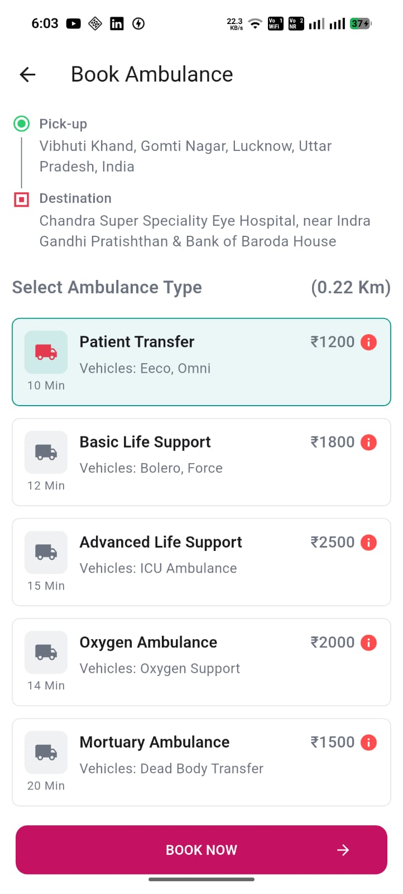

# 🚑 Ambulance Booking App

A Flutter-based ambulance booking application with clean architecture, modern UI, and real-time selection handling using GetX.

---

## 📱 Features

- 🚑 Browse multiple ambulance types
- 📍 Pickup & destination UI (timeline style)
- ✅ Select ambulance with single selection logic
- ⏱️ Dynamic timer support
- 🧾 Clean bottom sheet CTA (Book Now)
- 🔙 Exit confirmation bottom sheet
- ⚡ Smooth state management using GetX
- 🎯 Clean architecture (Separation of concerns)

---

## 🏗️ Architecture

This project follows **GetX Clean Architecture**:

## 📸 Screenshots

### 🚑 Home Screen with Ambulance List

